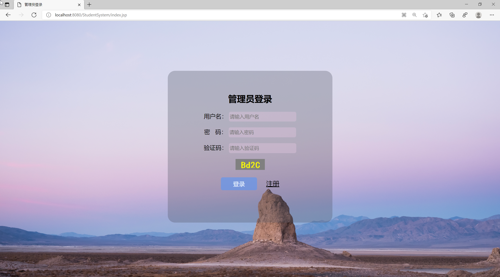
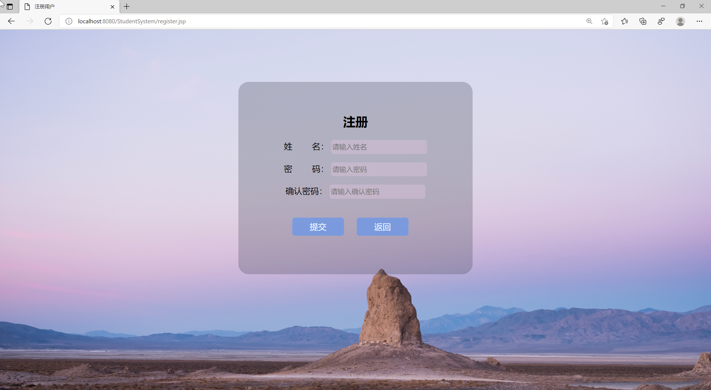
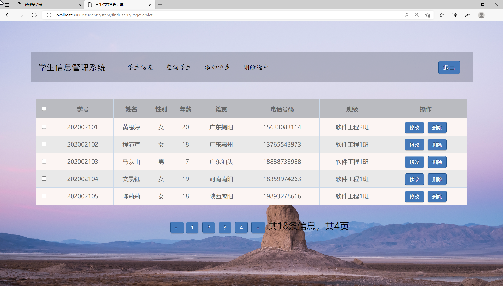
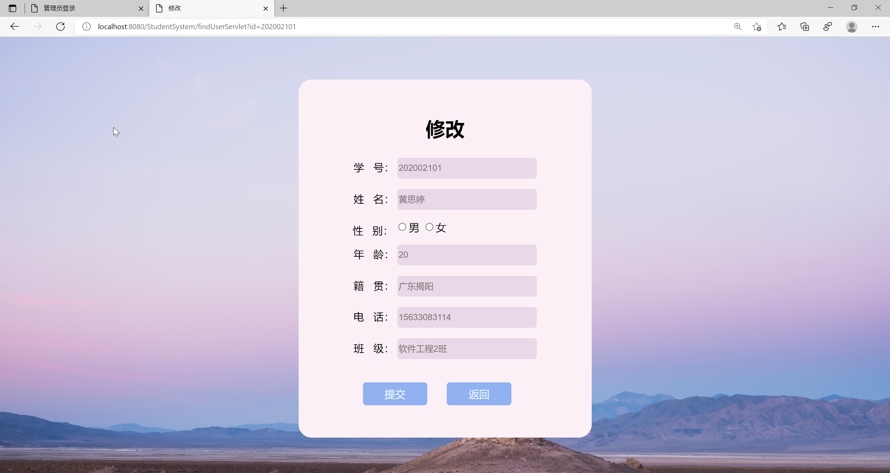
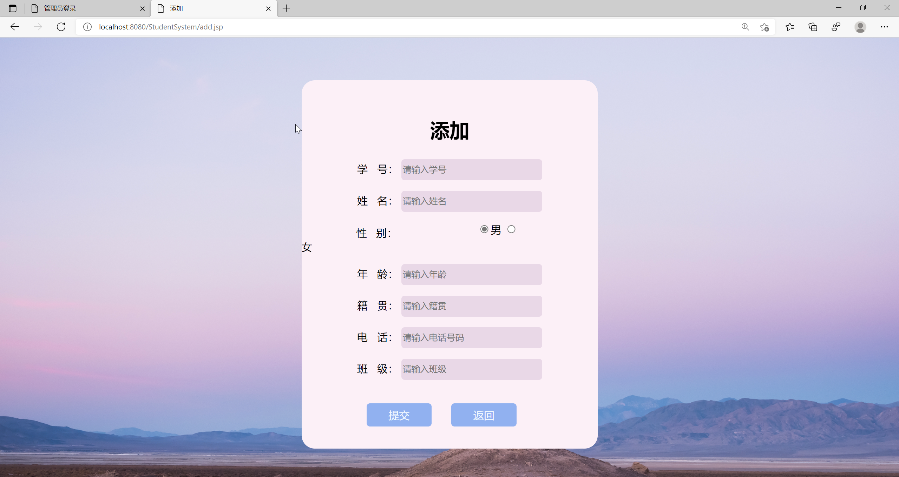
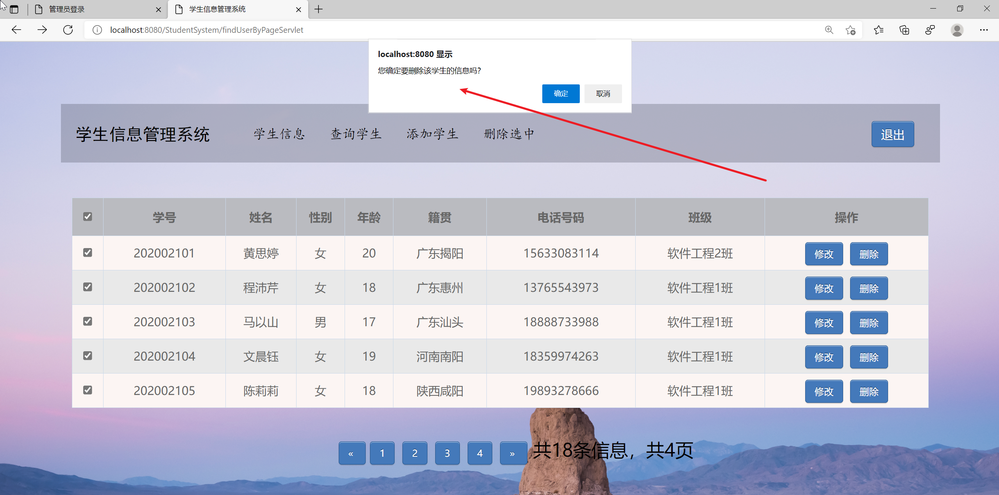

<h1 align="center">基于JSP+Servlet实现的学生信息管理系统【带文档】</h1>

 获取sql文件 QQ: 3645296857 QQ群: 978300347 

<h4> 需要视频演示可联系上述QQ，私发视频链接 </h4>

 获取更多高质量源码，请访问：[mzoo源码网](https://mzoocodes.com/)

## 简介

> 本代码来源于网络,仅供学习参考使用!
>
> <b style="color: dodgerblue"> 提供1.远程部署/2.修改代码/3.定制程序/4.文档指导/5.框架代码讲解、技术解答、代码讲解等服务 </b>
>
> 登录首页：http://localhost:8080/StudentSystem/index.jsp
> 
> 管理员: zhangsan 密码: 123456
>

## 项目介绍

基于JSP+Servlet实现的学生信息管理系统【带文档】：前端 JSP、BootStrap、JQuery、Ajax，后端 Servlet，系统角色分为：管理员。本系统采用B/S结构，使用JAVA开发语言，结合JSP技术，以MySQL作为后台数据库。该系统包括前端用户界面和后台管理。主要功能如下：

### 管理员
- 基本操作：登录、注册、修改密码、重置其他账号密码、登出
- 学生信息管理：筛选学生信息、添加学生信息、修改学生信息、删除学生信息、获取学生信息列表、查看学生信息详情、批量删除

## 环境

- <b>IntelliJ IDEA 2020.3</b>

- <b>Mysql 5.7.26</b>

- <b>Tomcat 8.0.32</b>

- <b>JDK 1.8</b>

## 运行截图

